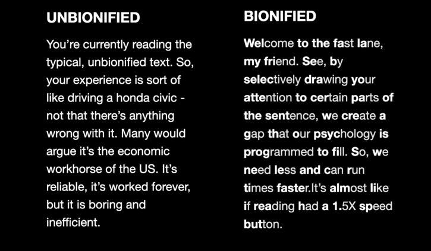

# Quick Reader

A simple chrome extension that implements bionic reading to help you read more efficiently.

Here's an example of highlighted text to demonstrate the difference:

(text example taken from jiffy reader)

## Credit
Quick Reader is an extension that was inspired by [Bionic Reading®](https://bionic-reading.com/). Note, however, that it does not in any way make use of the Bionic Reading® API - instead, the algorithm implements some code from the open-source developers of [jiffy reader](https://github.com/ansh/jiffyreader.com) and [fastread](https://github.com/ahrm/chrome-fastread). Many thanks to all of these developers for making this project possible.